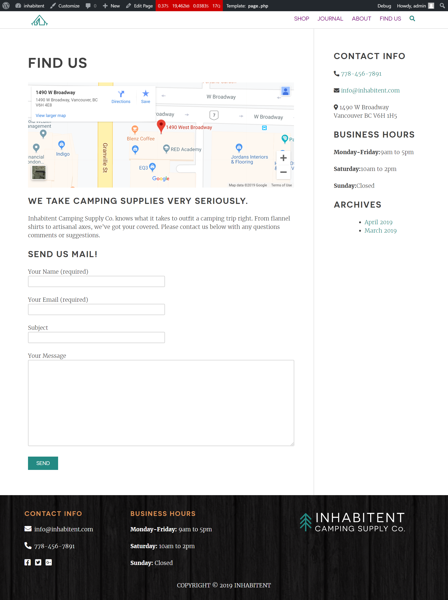
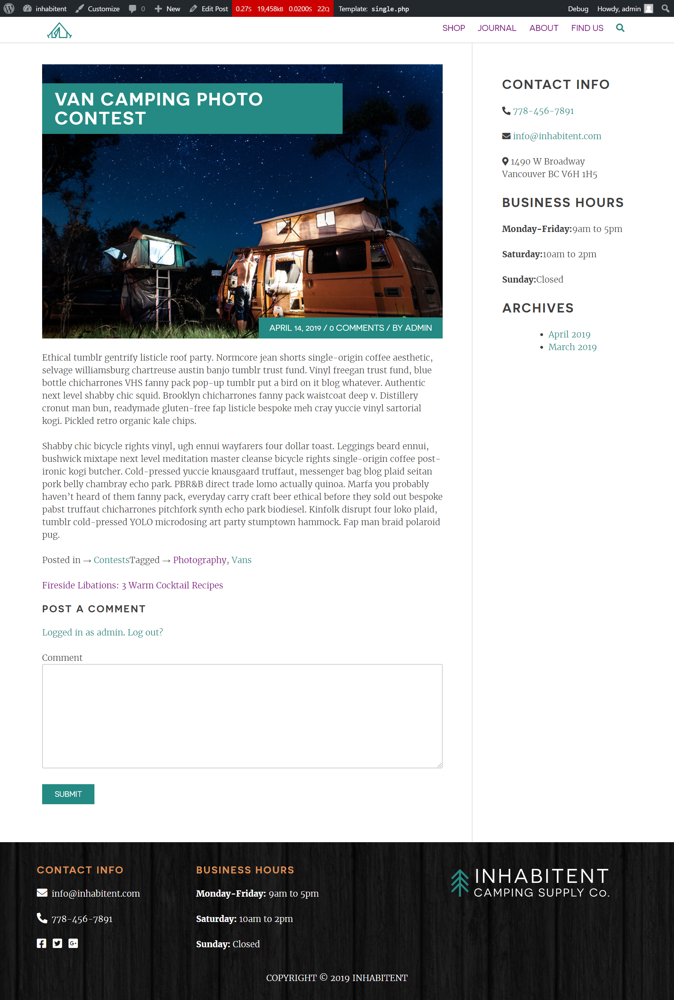

# Inhabitent Wordpress Site
This is a Wordpress site containing custom wordpress template and a custom plugin for an Inhabitent company. Custom plugin is used to implement a widget for adding customizable Business Hours.

* Fixed Width size: 1120px.

##This site is based on :

## RED Starter Theme

A WordPress starter theme for site, forked from Underscores.

### Installation

#### 1. Download me (don't clone me!)

Then add me to your `wp-content` directory.

#### 2. Rename the `redstarter-master` directory

Make sure that the theme directory name is project appropriate!

#### 3. Install the dev dependencies

Next you'll need to run `npm install` **inside your theme directory** next to install the node modules you'll need for Gulp, etc.

#### 4. Update the proxy in `gulpfile.js`

Lastly, be sure to update your `gulpfile.js` with the appropriate URL for the Browsersync proxy (so change `localhost[:port-here]/[your-dir-name-here]` to the appropriate localhost URL).

## RED Widget Boilerplate

A Wordpress starter plugin for customizable Business Hour Widget.

#Technologies Used
* Gulp
* HTML
* Php
* Sass
* JQuery
* Wordpress
 - Custom Post Types
 - Custom Taxonomies
 - Custom Plugins
 - Wordpress Plugins
* Wordpress Functions
* PhpmyAdmin Database

## Learnings

### About Wordpress:
WordPress is a content management system based on PHP and MySQL that is usually used with the MySQL or MariaDB database servers but can also use the SQLite database engine. Features include a plugin architecture and a template system.

It is most associated with blogging but supports other types of web content including more traditional mailing lists and forums, media galleries, and online stores. Used by more than 60 million websites, including 33.6% of the top 10 million websites as of April 2019,WordPress is the most popular website management system in use. WordPress has also been used for other application domains such as pervasive display systems.

### About PhpmyAdmin:
phpMyAdmin is a free and open source administration tool for MySQL and MariaDB. As a portable web application written primarily in PHP, it has become one of the most popular MySQL administration tools, especially for web hosting services.

## Website Preview

### Homepage

### Shop 

### Product Type

### Journals

### About

### FindUs

### Latest Adventure (Single Post)

### Shop Stuff (Single Product)

### Inhabitent Journal (Single Post)

